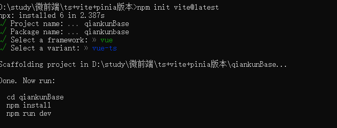

## 一：使用vite创建vue3项目

* 1:运行指令: npm init vite@latest 此时已经到了vite3版本，项目搭建时为2  npm init vite@2

  2:进行项目配置
  * 

* 3: 执行 npm i 下载npm包
* 4：执行 npm run dev 启动项目

## 二：集成Eslint

### 1、安装Eslint步骤

* 1：安装EsLint  ==npm i -D eslint==
* 2：初始化配置EsLint  ==npx eslint --init==
  * 2.1 选择模式： To check syntax, find problems, and enforce code style 严格模式
    * 
  * 2.2 选择语言模块：选择javascript
    * 
  * 2.3 选择语言框架 选择vue.js
    * 
  * 2.4 是否使用ts，视自己情况而定，之前创建时选择 yes，现在选择No
  * 新版选择yes后会==影响==2.7步骤的选择 ,所以现在==建议不选择==
    * 
  * 2.5  代码在哪里运行 使用空格键全选 浏览器+node
    * 
  * 2.6 选择一个风格：选择流行的即可
    * 
  * 2.7 你想遵循哪一种风格指南? 选择 Standard 我一直用的这个社区指南，感觉很好。认可度也高
  * ==注意之前选项有4个==
    * 
  * 现在只有==两个==，而且同是Standard 下载地址已经变了（==新的版本==，携带了typescript）
  * 若之前不选择ts，则还是之前的四个
  * 
  * 2.8 您希望的配置文件是什么格式? 选择js即可
    * 
  * 2.9 可能会出现下面的提示，选择yes即可
    * 
  * 2.10 会问你是用npm安装还是yarn安装，这里选择的npm(yes)
    * 


* 3、 安装完成会出现.eslintrc.js文件

### 2、下载plugin配置vite

* 1、安装vite-plugin-eslint  ==npm i -D vite-plugin-eslint==  可以将eslint检查到的错误在页面上显示

* 2、npm i -D @typescript-eslint/parser  安装eslit的parser解析器，不配置解析器会出现 error  Parsing error: Unexpected token ) 的错误

* 3、配置vite.config.js文件

* ```javascript
  // vite.config.js 文件
  import eslintPlugin from 'vite-plugin-eslint'
  
  export default defineConfig({
    plugins: [
      vue(),
      // 添加下面这块 配置 Eslint 可检测的文件
      eslintPlugin({
        include: ['src/**/*.js', 'src/**/*.ts', 'src/**/*.vue', 'src/*.js', 'src/*.ts', 		'src/*.vue']
      })
    ]
  }
  ```

> 配置完步骤3中的parser解析器才能正常启动项目

### 3、配置.eslintrc.js文件

> ==若 eslint 初始化时选择了typescript则需要在 extends中进行修改==
>
> 将 ==standard-with-typescript== 改为 ==standard== ， 否则会影响vite-plugin-eslint 插件的使用


> 在 parserOptions 中配置 ts的eslint解析器 parser: '@typescript-eslint/parser'

```javascript
module.exports = {
  env: {
    browser: true,
    es2021: true,
    node: true
  },
  extends: [
    'plugin:vue/vue3-essential',
    'standard'
  ],
  parserOptions: {
    ecmaVersion: 'latest',
    // eslint 的 typescript 解析器；不配置解析器会出现 error  Parsing error: Unexpected token ) 的错误
    parser: '@typescript-eslint/parser',
    sourceType: 'module'
  },
  plugins: [
    'vue'
  ],
  rules: {
    'no-var': 'error', // 禁止使用 var
    indent: 'off', // 缩进2格
    'no-mixed-spaces-and-tabs': 'error', // 不能空格与tab混用
    'vue/html-closing-bracket-newline': 'off', // 不强制换行
    'vue/singleline-html-element-content-newline': 'off', // 不强制换行
    'vue/multi-word-component-names': 'off', // 不强制给组件命名
    'vue/max-attributes-per-line': ['error', {
      singleline: { max: 3 },
      multiline: { max: 1 }
    }], // vue template模板元素第一行最多3个属性, 大于三个需要换行且一行一个
    'vue/html-indent': 'off',
    'prefer-const': 'off' // 禁止未使用变量强制使用const 因为ref使用的是obj.value方式操作变量
  }
}

```

### 4、配置vscode的 settings.json文件 

* 可在.vscode文件夹下创建此文件  此文件可实现保存进行eslint格式化

```javascript
{
  "editor.codeActionsOnSave": {
    "source.fixAll.eslint": true
  },
  "eslint.validate": [
    "javascript",
    "javascriptreact",
    "typescript"
  ],
  "typescript.tsdk": "node_modules/typescript/lib"
}
```


##  三：vite文件配置

### 1、配置别名，vite默认没有别名配置

```javascript
import { resolve } from 'path'
export default defineConfig({
  // 配置别名，vite默认是没有别名配置的
  resolve: {
    alias: {
      '@': resolve('src')
    }
  }
})

```

#### 1.1、 找不到模块path或其对应的类型声明提示

* ​	若遇到引入 resolve 模块 报找不到模块path或其对应的类型声明提示 则需要下载执行 ==npm install @types/node --save-dev==  然后重新打开vscode即可解决

### 2、tsconfig.json文件配置别名提示

```javascript
// 添加以下两行代码即可
"baseUrl": "./",
"paths": {
"@/*":["src/*"]
}
```

* 此时使用@的时候才会有路径提示，而且也不会在使用@引入文件后报找不到模块的错误提示

### 2、配置全局css变量

```javascript
export default defineConfig({
  // 设置全局样式
  css: {
    preprocessorOptions: {
      scss: {
        additionalData: '@import "@/assets/css/variables.scss";'
      }
    }
  }
})

```

### 3、配置打包

```javascript
export default defineConfig({
  build: {
    sourcemap: false, // 关闭映射文件，减小打包体积
    minify: 'terser', // 混淆器，terser构建后文件体积更小
    // chunkSizeWarningLimit: 1500, // 打包单个文件体积大小 默认为500kb
    terserOptions: {
      compress: {
        drop_console: true, // 生产环境移除 console
        drop_debugger: true // 生产环境移除 debugger
      }
    },
    // rollupOptions 将打包文件按照node_modules里边的包名进行分割
    rollupOptions: {
      output: {
        manualChunks (id) {
          if (id.includes('node_modules')) {
            return id
              .toString()
              .split('node_modules/')[1]
              .split('/')[0]
              .toString()
          }
        },
        chunkFileNames: (chunkInfo) => {
          const facadeModuleId = chunkInfo.facadeModuleId
            ? chunkInfo.facadeModuleId.split('/')
            : []
          const fileName =
            facadeModuleId[facadeModuleId.length - 2] || '[name]'
          return `js/${fileName}/[name].[hash].js`
        }
      }
    }
  }
})

```

### 4、完整的vite.config配置文件

```javascript
import { defineConfig } from 'vite'
import vue from '@vitejs/plugin-vue'
import eslintPlugin from 'vite-plugin-eslint'
import { resolve } from 'path'
// https://vitejs.dev/config/
export default defineConfig({
  plugins: [
    vue(),
    eslintPlugin({
      include: ['src/**/*.js', 'src/**/*.ts', 'src/**/*.vue', 'src/*.js', 'src/*.ts', 'src/*.vue']
    })
  ],
  // 配置别名，vite默认是没有别名配置的
  resolve: {
    alias: {
      '@': resolve('src')
    }
  },
  // 设置全局样式
  css: {
    preprocessorOptions: {
      scss: {
        additionalData: '@import "@/assets/css/variables.scss";'
      }
    }
  },
  build: {
    sourcemap: false, // 关闭映射文件，减小打包体积
    minify: 'terser', // 混淆器，terser构建后文件体积更小
    // chunkSizeWarningLimit: 1500, // 打包单个文件体积大小 默认为500kb
    terserOptions: {
      compress: {
        drop_console: true, // 生产环境移除 console
        drop_debugger: true // 生产环境移除 debugger
      }
    },
    // rollupOptions 将打包文件按照node_modules里边的包名进行分割
    rollupOptions: {
      output: {
        manualChunks (id) {
          if (id.includes('node_modules')) {
            return id
              .toString()
              .split('node_modules/')[1]
              .split('/')[0]
              .toString()
          }
        },
        chunkFileNames: (chunkInfo) => {
          const facadeModuleId = chunkInfo.facadeModuleId
            ? chunkInfo.facadeModuleId.split('/')
            : []
          const fileName =
            facadeModuleId[facadeModuleId.length - 2] || '[name]'
          return `js/${fileName}/[name].[hash].js`
        }
      }
    }
  }
})

```


#### 备注：目前为止基础版的配置已经完成  下面开始集成第三方库

## 四、环境变量以及执行命令配置

### 1、环境变量

* .env.development 开发环境

* ```javascript
  # just a flag
  ENV = 'development'
  
  # base api/url
  VITE_BASE_API = 'http://10.30.150.13001/xxx'
  VITE_CHILDONE_URL = '//localhost:13001'
  
  ```

* .env.production 生产环境

* .env.test 测试环境

```javascript
# just a flag
ENV = 'production'

# base api/url
VITE_BASE_API = 'http://10.30.150.13001/xxx'
VITE_CHILDONE_URL = 'http://10.30.150.13001'

```

* 实际开发中项目可能还有其他环境自行配置即可

### 2、执行命令

* 在packjson文件中
* "dev": "vite" ==启动==本地项目对应环境变量==.env.development==
* "build": "vue-tsc --noEmit && vite build"  ==打包生产环境==对应环境变量==.env.production ===
* =="build:test"==: "vue-tsc --noEmit && vite build ==--mode test==", ==打包测试环境==对应环境变量.env.development
* "test":"vue-tsc --noEmit" ==检测代码==是否都符合TS规范，通过后再上传代码到git仓库，不然打包时会出错

## 五、引入Element

### 1、下载包 ==npm install element-plus --save==

### 2、按需引入

* 2.1、安装`unplugin-vue-components` 和 `unplugin-auto-import`这两款插件

* 2.2 引入到vite中

* ```javascript
  // vite.config.ts
  import { defineConfig } from 'vite'
  import AutoImport from 'unplugin-auto-import/vite'
  import Components from 'unplugin-vue-components/vite'
  import { ElementPlusResolver } from 'unplugin-vue-components/resolvers'
  
  export default defineConfig({
    // ...
    plugins: [
      // ...
      AutoImport({
        resolvers: [ElementPlusResolver()],
      }),
      Components({
        resolvers: [ElementPlusResolver()],
      }),
    ],
  })
  ```

* 接下来直接在项目中引入想使用的组件即可

## 六、vue-router 引入

### 1、 下载包 ==npm install vue-router@4==

### 2、在src下创建 router 文件夹（包含index.ts文件与moudles文件夹）


### 3、在index.ts文件中引入vue-router

* 采用hash模式

```javascript
import { createRouter, createWebHashHistory } from 'vue-router'

// 引入路由
import routes from './moudles'

const router = createRouter({
  history: createWebHashHistory(),
  routes
})
export default router

```

### 4、配置modules下的文件，目前只写一个index文件

* RouteRecordRaw 为vue-router的类型约束

```javascript
import { RouteRecordRaw } from 'vue-router'
let indexConfig:RouteRecordRaw[] = [
  {
    path: '/',
    // redirect: '/home',
    meta: {
      active: 'home'
    },
    component: () => import('@/App.vue')
  }
]
// 暴露出去一个route希望得到的路由结构
export default indexConfig

```

### 5、在main.ts中引入

```javascript
import { createApp } from 'vue'
import App from './App.vue'
// 引入路由
import router from './router'
const instance = createApp(App)
instance.use(router)
instance.mount('#app')

```

## 七、pinia 状态管理的引入

### 1、下载包 

* ==npm install pinia== 此包是pinia

* ==npm install pinia-plugin-persistedstate== 此包做持久化缓存

### 2、src下创建store文件夹（包含index.ts文件与moudles文件夹）

### 3、在index.ts文件中引入pinia

```javascript
import { createPinia } from 'pinia'
// 持久化处理
import piniaPluginPersistedstate from 'pinia-plugin-persistedstate'
// 引入根据模块创建好的状态管理
import { useMainStore } from './modules/mainStore'
// 创建pinia状态管理对象
const pinia = createPinia()
pinia.use(piniaPluginPersistedstate)
// 暴露
export { useMainStore }
export default pinia

```

### 4、配置modules下的文件，目前只写一个mainStore**文件**

```javascript
import { defineStore } from 'pinia'
export const useMainStore = defineStore('main', {
  // 所有数据持久化
  // persist: true,
  // 持久化存储插件其他配置
  persist: {
    // 修改存储中使用的键名称，默认为当前 Store的 id
    key: 'storekey',
    // 修改为 sessionStorage，默认为 localStorage
    storage: window.sessionStorage
  },
  state: () => {
    return {
      someState: <string>'hello pinia'
    }
  }
})

```

### 5、在main.ts**中引入**

```javascript
// pinia
import pinia from './store'
instance.use(pinia)
```

### 6、在组件中使用

```javascript
<script setup lang="ts">
import { storeToRefs } from 'pinia'
import { useMainStore } from './store'
const $store = useMainStore()
// 使用storeToRefs可以保证解构出来的数据也是响应式的
const { someState } = storeToRefs($store)
console.log(someState.value) 
</script>
```

## 八、stroage的二次封装

* 放在src/utils目录下

```javascript
/**
 * @desc 借助js-base64进行加密
 * @method Base64.encode 进行加密
 * @method Base64.decode 进行解密
 */
import { Base64 } from 'js-base64'
let Storage = {
  // ==================sessionsTorage设置缓存================
  // 设置缓存

  sessionSet: function<T> (name:string, data:T) {
    sessionStorage.removeItem(name)
    sessionStorage.setItem(name, Base64.encode(JSON.stringify(data)))
  },
  // 获取缓存
  sessionGet: function (name:string) {
    if (sessionStorage.getItem(name)) {
      return JSON.parse(Base64.decode(sessionStorage.getItem(name) || ''))
    } else {
      return false
    }
  },
  // 清除缓存
  sessionRemove: function (name:string) {
    sessionStorage.removeItem(name)
  },
  // ==================localStorage设置缓存==================
  // 设置缓存
  localSet: function<T> (name:string, data:T) {
    localStorage.removeItem(name)
    localStorage.setItem(name, Base64.encode(JSON.stringify(data)))
  },
  // 获取缓存
  localGet: function (name:string) {
    if (localStorage.getItem(name)) {
      JSON.parse(Base64.decode(sessionStorage.getItem(name) || ''))
    } else {
      return ''
    }
  },
  // 清除缓存
  localRemove: function (name:string) {
    localStorage.removeItem(name)
  }

}
export default Storage

```

## 九、Axios的二次封装

* 放在src/utils目录下

### 1、下载包==npm i axios==

### 2、进行配置

```javascript
import axios from 'axios'
import Storage from './storage'
import { ElMessage } from 'element-plus'
const createService = (baseURL:string) => {
  // 基础配置，时间
  const _axios = axios.create({
    timeout: 5 * 60 * 1000, // 超时时间
    baseURL
  })
  let token = Storage.localGet('project-token')
  // 在发送请求之前
  _axios.interceptors.request.use(config => {
    if (token) {
      (config.headers as any)['project-token'] = token
    }
    return config
  }, err => {
    return Promise.reject(err)
  })

  /**
   * @desc http response 拦截器
   * @response data.code 接口返回的状态码（具体视接口返回而定），
   * 若为0则请求成功则返回数据，若为10001则代表token过期需退出登录
   * 否则则代表请求失败
   */
  _axios.interceptors.response.use(response => {
      if (response.data.code === 0) {
        return response.data
      } else if (response.data.code === 10001) {
        ElMessage({
          type: 'error',
          message: response.data.errorMsg
        })
        return Promise.reject(response.data)
      } else {
        ElMessage({
          type: 'error',
          message: response.data.errorMsg
        })
        return Promise.reject(response.data)
      }
    },
    error => {
      console.log(error)
      return Promise.reject(error.response.data)
  })
  return _axios
}
export const authServer = createService(import.meta.env.VITE_BASE_API || '')

```

### 3、返回值response类型处理

* 若返回值的名称不为data（axios默认的AxiosResponse配置包含了data），则需要在 .d.ts文件当中重新修改axios方法的返回值的类型约束

* 不然每次写完.then的res都需要声明类型

  ```javascript
  /// <reference types="vite/client" />
  import { AxiosRequestConfig } from 'axios'
  
  declare module '*.vue' {
    import type { DefineComponent } from 'vue'
    const component: DefineComponent<{}, {}, any>
    export default component
  }
  
  declare module 'axios' {
    export interface AxiosInstance {
      <T = any>(config: AxiosRequestConfig): Promise<T>;
      request<T = any> (config: AxiosRequestConfig): Promise<T>;
      get<T = any>(url: string, config?: AxiosRequestConfig): Promise<T>;
      delete<T = any>(url: string, config?: AxiosRequestConfig): Promise<T>;
      head<T = any>(url: string, config?: AxiosRequestConfig): Promise<T>;
      post<T = any>(url: string, data?: any, config?: AxiosRequestConfig): Promise<T>;
      put<T = any>(url: string, data?: any, config?: AxiosRequestConfig): Promise<T>;
      patch<T = any>(url: string, data?: any, config?: AxiosRequestConfig): Promise<T>;
    }
  }
  
  ```

## 十、全局样式的引入以及预编译sass的下载

### 1、下载包 ==npm i sass -D== 

* 下载完成后即可在项目中直接使用 lang=scss，此构建器是vite不是webpack，不需要sass-loader

### 2、引入全局样式

* 此文件放在src/assets/css目录下

* 在APP.vue组件中进行引入

* ```
  @import './assets/css/reset.css';
  ```

```javascript
/**
 * Eric Meyer's Reset CSS v2.0 (http://meyerweb.com/eric/tools/css/reset/)
 * http://cssreset.com
 */
*{
  margin: 0;
  padding: 0;
  border: 0;
  font-size: 100%;
  vertical-align: baseline;
  outline: none;
  font-style: normal;
  box-sizing: border-box;
  font-family: "Pingfang SC",Tahoma,"Helvetica Neue",Arial,Hiragino Sans GB,"Microsoft YaHei",Sans-Serif;
}
button, input, select, textarea{
  -webkit-tap-highlight-color: rgba(0,0,0,0);
  -webkit-tap-highlight-color: transparent;
  -webkit-appearance:none;
  outline: none;
}
/* HTML5 display-role reset for older browsers */

blockquote, q{
  quotes: none
}
blockquote:before, blockquote:after,
q:before, q:after{
  content: none
}
table{
  border-collapse: collapse;
  border-spacing: 0;
}

	/* 隐藏掉滚动条*/
.scroll-el{overflow:auto;} 
.scroll-el::-webkit-scrollbar{width:0;height:0;visibility:hidden;display:none;}

::-webkit-scrollbar {width: 5px;height:7px;background: rgba(0,0,0,.1);}
::-webkit-scrollbar-thumb {border-radius: 6px;background: rgba(0,0,0,.2);}
::-ms-scrollbar {width: 5px;height:7px;background: rgba(0,0,0,.1);}
::-ms-scrollbar-thumb {border-radius: 6px;background: rgba(0,0,0,.2);}
::-webkit-input-placeholder{color:#cacaca !important;}
::-moz-placeholder{color:#cacaca !important;;}
:-ms-input-placeholder{color:#cacaca !important;}

body{
  -webkit-text-size-adjust: none;
  -webkit-tap-highlight-color: rgba(0, 0, 0, 0);
  -webkit-overflow-scrolling: touch;
  z-index: 1;
}
body, html {
  height: 100%;
  min-height: 100%;
  font-size: 14px;
  /* font-family: "PingFang SC","Helvetica Neue",BlinkMacSystemFont, STHeiti,"Microsoft Yahei",Tahoma,Simsun,sans-serif; */
  font-family: "Pingfang SC",Tahoma,"Helvetica Neue",Arial,Hiragino Sans GB,"Microsoft YaHei",Sans-Serif;
}
  
/* custom */
a{
  color: #1a1a1a;
  -webkit-backface-visibility: hidden;
  text-decoration: none;
}

input:-webkit-autofill{
  box-shadow : 0 0 0 1000px #fff inset;
}
li{list-style: none}


```


## 十一、微前端 qiankun 配置

### 1、下载包 ==npm i qiankun== 

### 2、main.ts引入qiankun

```javascript
import { createApp } from 'vue'
import App from './App.vue'
// 引入路由
import router from './router'
// pinia
import pinia from './store'
// qiankun
import { registerMicroApps } from 'qiankun'
const instance = createApp(App)
instance.use(router)
instance.use(pinia)
instance.mount('#app')
// qiankun 引入子应用
registerMicroApps([
  {
    name: 'childOne',
    entry: import.meta.env.VITE_CHILDONE_URL,
    container: '#container',
    activeRule: '#/base/child/one',
    // loader:(loading) => render(loading),
    props: {
      token: 'sub-application-001'
    }
  }
])

```

### 3、创建容器组件

#### 1、创建目录 src/views/CommonApp.vue

* 作用：控制整个项目的布局以及子应用的显示

```javascript
<template>
  <div class="common-layout">
    <el-container>
      <el-aside width="200px">Aside</el-aside>
      <el-container>
        <el-header>Header</el-header>
        <el-main>
          <!-- 微应用 -->
          <router-view/>
          <!-- <div id="container"></div> -->
        </el-main>
      </el-container>
    </el-container>
  </div>
</template>

<style lang="scss" scoped>
.common-layout {
  height: 100%;
  background: $commonBgColor;
  .el-aside{
    height: 100%;
    background: pink;
  }
  .el-header{
    background: blanchedalmond;
  }
  .el-container{
    height: 100%;
  }
  .el-main{
    height: 100%;
    padding: 8px 7px;
    box-sizing: border-box;
    #container{
      height: 100%;
      background: burlywood;
    }
  }
}
</style>

```


#### 2、创建目录 src/views/Container/Container.vue

* 作用：子应用容器以及在合适时机加载子应用

```javascript
<template>
  <div id="container"></div>
</template>
<script setup lang="ts">
import { start } from 'qiankun'
import { computed, onMounted } from 'vue'
import { useMainStore } from '@/store'
// This starter template is using Vue 3 <script setup> SFCs
// Check out https://vuejs.org/api/sfc-script-setup.html#script-setup
const $store = useMainStore()
const loading = computed(() => $store.$state.loading)
console.log(loading.value)
let win:any = window
onMounted(() => {
  if (!win.qiankunStarted) {
    console.log(111)
    win.qiankunStarted = true
    start({ sandbox: { experimentalStyleIsolation: true } })
  }
})
</script>

```

### 3、修改路由表（moduls/index.ts下的）

* redirect 第一个需要显示的子应用
* /base 作为布局容器组件的路径
* 子应用作为base的children子路由

```javascript
import { RouteRecordRaw } from 'vue-router'
let indexConfig:RouteRecordRaw[] = [
  {
    path: '/',
    redirect: '/base/child/one'
  },
  {
    path: '/base',
    component: () => import('@/views/CommonApp.vue'),
    children: [
      {
        path: 'child/one',
        component: () => import('@/views/Container/Container.vue'),
        meta: {
          active: 'childOne'
        }
      }
    ]
  }
]
// 暴露出去一个route希望得到的路由结构
export default indexConfig

```

###  4、此时主应用搭建完成

## 十二、子应用搭建

### 1、路由表、main.ts 、views目录下文件、App.vue、vite.config.ts 有变动，其他配置同主应用

### 2、下载子应用所需的微前端包 ==npm i vite-plugin-qiankun==

### 3、配置vite.config文件

#### 3.1、增加 环境变量 判断

* 需要判断环境变量 所以需要vite的loadEnv来获取环境变量，mode获取模式

* 1、引入loadEnv ==import { defineConfig, loadEnv } from 'vite'==

* 2、修改 export default

* ```javascript
  export default ({ mode }) => {
    return defineConfig({
        ......
    })
  }
  
  ```

#### 3.2、配置base

* 部署生产环境后主应用引入子应用的文件路径需为完整的路由，在搭配server的配置即可解决静态资源404问题

* ```javascript
  export default ({ mode }) => {
    return defineConfig({
        base: mode === 'development' ? '/' : loadEnv(mode, process.cwd()).VITE_CHILDONE_URL + '/',
    })
  }
  ```

#### 3.3、配置plugins

```javascript
import qiankun from 'vite-plugin-qiankun'
const packName = require('./package').name
export default ({ mode }) => {
  return defineConfig({
      plugins: [
            // 配置qiankun
            qiankun(`${packName}`, {
                useDevMode: true
            }),
        ],
  })
}
```

#### 3.4、配置server

* port: 启动端口

* origin：用于定义开发调试阶段生成资产的 origin。

```javascript
server: {
    port: +loadEnv(mode, process.cwd()).VITE_CHILDONE_URL.split(':')[1],
    origin: loadEnv(mode, process.cwd()).VITE_CHILDONE_URL
}
```

### 4、修改main.ts文件

* 1、引入qiankun的 ==renderWithQiankun==, ==qiankunWindow==
* 2、将创建vue实例以及use相关的内容放到 ==render== 函数中
  * 微前端环境下会给render函数传入参数
  * 自启动下无参数
* 使用==renderWithQiankun==包裹微前端的生命周期（webpack不需要，vite需要）
* 判断是否是基于qiankun环境下运行的 ==qiankunWindow.__POWERED_BY_QIANKUN =__==

```javascript
import { createApp } from 'vue'
import { renderWithQiankun, qiankunWindow } from 'vite-plugin-qiankun/dist/helper'
import App from './App.vue'
// 引入路由
import router from './router'
// pinia
import pinia from './store'
let instance: any = null

function render (props: any = {}) {
  const { container } = props
  instance = createApp(App)
  instance.use(router)
  instance.use(pinia)
  instance.mount(container ? container.querySelector('#app') : '#app')
}
renderWithQiankun({
  mount (props: any) {
    render(props)
  },
  bootstrap () {
    console.log('%c', 'color:green;', ' ChildOne bootstrap')
  },
  update () {
    console.log('%c', 'color:green;', ' ChildOne update')
  },
  unmount (props: any) {
    console.log('unmount', props)
    instance.unmount()
    instance._container.innerHTML = ''
    instance = null
  }
})

if (!qiankunWindow.__POWERED_BY_QIANKUN__) {
  render()
}

```

### 5、创建home文件  src/views/home

* 具体根据自己项目写即可，这里只为能够在主应用中引进并显示内容

```javascript
<template>
  <div>
    <HelloWorld msg="微前端"/>
  </div>
</template>
<script lang="ts" setup>
import HelloWorld from '@/components/HelloWorld.vue'
</script>

```

### 6、配置路由表

* 具体根据自己项目写即可，这里只为能够在主应用中引进并显示内容

```javascript
import { RouteRecordRaw } from 'vue-router'
let indexConfig:RouteRecordRaw[] = [
  {
    path: '/',
    redirect: '/base/child/one'
  },
  {
    path: '/base/child/one',
    component: () => import('@/views/Home/Home.vue'),
    meta: {
      active: 'childOne'
    }
  }
]
// 暴露出去一个route希望得到的路由结构
export default indexConfig

```

### 7、提取常用样式封装为全局样式

* 因项目有的需要分页有的不需要分页，所以表格和分页组件不进行封装
* 因为分页一般都有边距，所以写一个全局样式，使用分页组件是给分页组件==套一个div==然后添加==类名pagination==即可
* 项目很多是上中下布局，中间需填充屏幕，所以封装全局样式==flex-column==
* 项目很多是水平垂直居中，封装全局样式==flex-center==
* 项目会有很多表格，表格需要填充屏幕中间区域，所以给el-table组件==套一个div==，然后添加==.table类名即可==

```javascript
/** 分页样式 */
.pagination{
  padding: 25px 22px;
  box-sizing: border-box;
}
/** flex纵向布局样式 */
.flex-column{
  display: flex;
  justify-content: center;
  flex-direction: column;
  height: 100%;
  background: $commonBgColor;
}
.flex-center{
  display: flex;
  justify-content: center;
  align-items: center;
}
/** 表格样式 实现表头固定 内容超出滚动 */
.table{
  flex: 1;
  overflow: hidden;
  // 表格若不添加 height:100% 使用以下代码
  .el-table__inner-wrapper{
    display: flex;
    flex-direction: column;
    height: 100%;
    .el-table__body-wrapper{
      flex: 1;
      overflow: auto!important;
    }
    // 若内容超出一直显示滚动条则使用以下代码
    // .el-scrollbar__bar.is-vertical{
    //   display: block!important;
    // }
  }
}

```

### 8、封装分页js

* 只要有分页的组价就都会定义分页组件所需的变量，所以对此封装为一个Hook，在有分页的地方直接引入hook即可， 无需重复定义
* 目录 src/Hooks/usePaginHandle.ts

```javascript
import { ref } from 'vue'
export default function () {
  let currentPage = ref('1')
  let pageSize = ref('10')
  let total = ref(0)
  const handleSizeChange = (callback?:any) => {
    callback?.()
  }
  const handleCurrentChange = (callback?:any) => {
    callback?.()
  }
  return {
    currentPage,
    pageSize,
    total,
    handleSizeChange,
    handleCurrentChange
  }
}

```

* 使用时在组件引入

  ```javascript
  import usePaginHandle from '@/views/Hooks/usePaginHandle'
  const { currentPage, pageSize, total, handleSizeChange, handleCurrentChange } = usePaginHandle()
  ```

  
